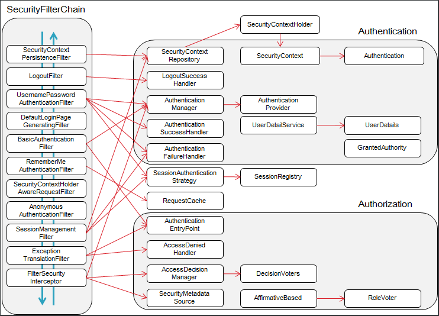

# Spring
Spring을 사용할 때 사용할 수 있는 Framework들을 체험해보고 Deep Dive하기 위한 프로젝트

---

## Spring Security
Spring에서 제공하는 보안 프레임워크

특이하게 Spring Context에서 작업하는 것이 아닌 Servlet영역에서 작업이 이루어지며,  
Spring에서는 Servlet영역에서 이뤄지는 작업들과 Spring Context영역에서 사용할 수 있는 Interface들을 제공하고,  
이를 구현하는 방식의 프레임워크

여러개의 Filter를 거쳐 인증/인가 절차를 수행

---

## Spring Batch

---

## Spring MVC

---

## Spring WebFlux